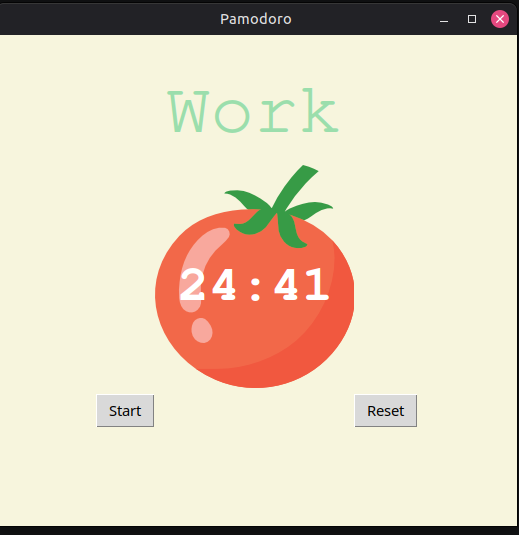

Pomodoro Timer

A desktop Pomodoro Timer built with Python and Tkinter that helps users stay focused and productive by following the Pomodoro Technique. The application automatically alternates between work sessions and breaks while tracking completed work sessions.

App Preview:

Features:

- 25-minute work sessions
- 5-minute short breaks
- 20-minute long break after every 4 work sessions
- Visual progress tracker using check marks
- Reset timer functionality
- Clean and simple Tkinter graphical interface

Built With:

- Python 
- Tkinter
